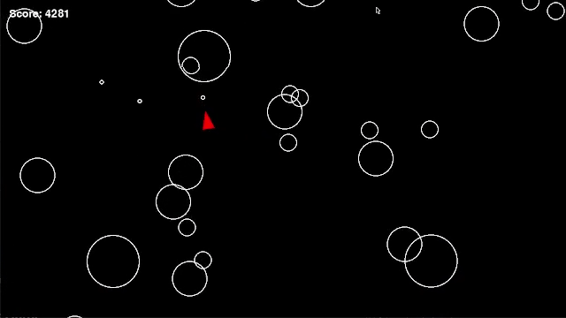

# Asteroids Game

A classic arcade-style **Asteroids** game built with Pygame.



## Description

Pilot your spaceship through an asteroid field, destroying asteroids while avoiding collisions. Smooth controls, dynamic asteroids, and a scoring system.

## Features

- Classic Asteroids gameplay
- Ship movement with rotation and thrust
- Asteroids that split into smaller pieces when hit
- Score tracking based on time survived and asteroids destroyed
- Pause functionality
- Game over screen with restart option

## Requirements

- Python 3.6+
- Pygame 2.0+

## Installation

1. Clone this repository:
```sh
git clone https://github.com/alxkt/asteroids.git
cd asteroids
```
2. Install the required packages:
```sh
pip install -r requirements.txt
```
3. Run the game:
```sh
python main.py
```

## Controls
- WASD: Rotate and move the ship
- SPACE: Fire (hold for continuous fire)
- ESC: Pause game
- Q: Quit (when paused)
- ENTER: Select/Restart (in menus)

## License

This project is licensed under the MIT License - see the [LICENSE](LICENSE) file for details.